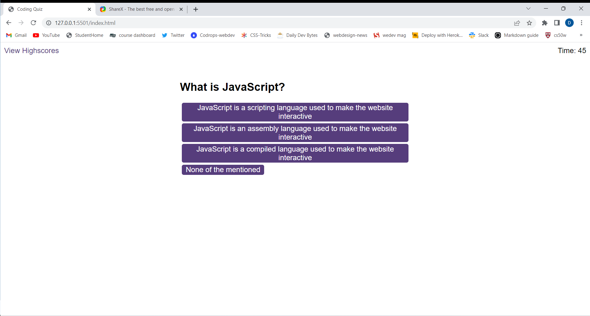
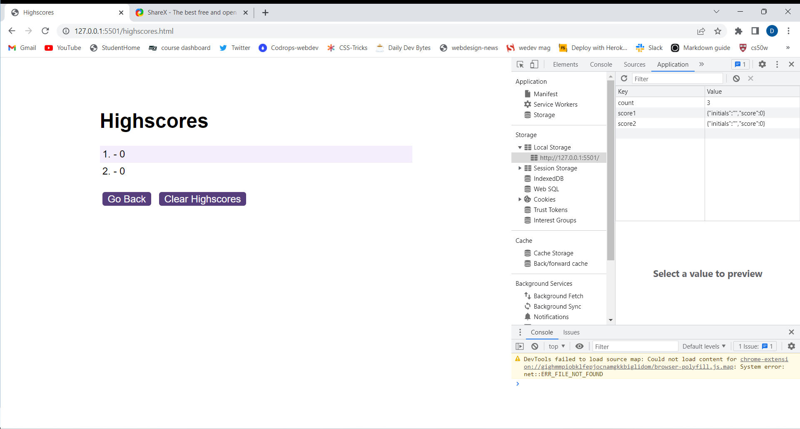

# JavascriptQuiz

## Description

## This app is a Quiz powered by Javascript to manipulate the DOM, changing css classes and appending elements and textContent. The scores are saved to in localStorage making the persistant, retrieved from localStorage and displayed in the highscores page sorted in ascending order.




## User Story

```
As a coding bootcamp student
I WANT to take a timed quiz on JavaScript fundamentals that stoes high scores
SO THAT i cna qauge my progress compared to my peers

```

---
